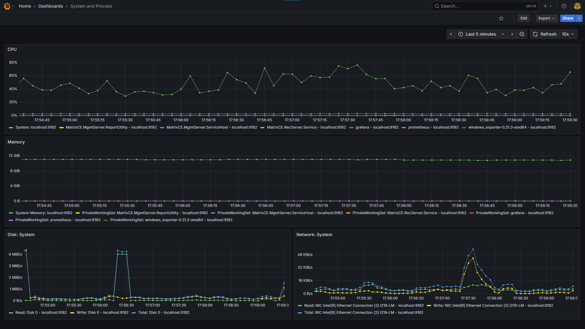

# Metrics Recorder & Visualiser (Windows)



## Steps to Run

### 1. Installation - Manual

Follow these steps to assemble a local, self‑contained monitoring toolchain under the `Programs` folder. The goal is to have three components side‑by‑side. After you download and extract the components, the simplified desired layout under `Programs` should look something like this:

```text
Programs/
  grafana-<version>/
    bin/
    conf/
    data/
    ...
  prometheus-<version>.<os>-<arch>/
    prometheus.exe
  windows_exporter-<version>-<arch>/
    windows_exporter-<version>-<arch>.exe
```

#### I. Prometheus

Source: <https://prometheus.io/download/>

Download the latest `prometheus-<version>.<os>-<arch>.zip` and extract into `Programs` folder.

#### II. Grafana

Source: <https://grafana.com/grafana/download>

Download the latest `grafana-<version>.<os>-<arch>.tar.gz` (.zip not available) and extract into `Programs` folder.

#### III. windows_exporter

Source: <https://github.com/prometheus-community/windows_exporter/releases>

Download the latest `windows_exporter-<version>-<arch>.exe` and place it into `Programs` folder.

### 2. Apply Configuration

Run the provided helper to apply the ready-to-run wirings, and dashboard template into the freshly downloaded Programs.

```powershell
.\Copy-ConfigToPrograms.ps1
```

### 3. Start the Stack

Use the PowerShell helper script to launch Grafana, Prometheus and the Windows Exporter each in their own powershell window:

```powershell
.\Start-MonitoringStack.ps1
```

- Log level is set to `warn/warning` for all components, if no warnings or errors are printed, everything should be running as expected.
- Access Grafana (default user/password: `admin`/`admin`) by going to <http://localhost:3000/dashboards>.
- Prometheus should be available at <http://localhost:9090/targets>.
- Windows Exporter should be available at <http://localhost:9182/metrics>.

## Stopping Components

Stop components by closing their window or pressing Ctrl+C inside it, or by running the following command to kill all related processes:

```powershell
Get-Process -Name "grafana*","prometheus*","windows_exporter*" -ErrorAction SilentlyContinue | Stop-Process -Force
```

## Applying Configuration

Use the `Copy-ConfigToPrograms.ps1` script to copy configuration files from the `Config` folder into the appropriate `Programs` folders:

```powershell
.\Copy-ConfigToPrograms.ps1
```

This script automatically copies configuration assets into versioned program folders, ensuring custom configurations are properly deployed to the installed programs.

### Configuration Script Parameters

| Parameter | Description | Default |
|-----------|-------------|---------|
| `-Component <string[]>` | Restrict to specific components | All component folders under ConfigRoot |
| `-AppyToAllVersions` | Copy into every matching program folder | Only most recent per component |
| `-Backup` | Create timestamped .bak copies before overwriting | (off) |
| `-DryRun` | Show actions without copying or creating folders | (off) |
| `-ConfigRoot <path>` | Root containing component configuration folders | `.\Config` |
| `-ProgramsRoot <path>` | Root containing installed program folders | `.\Programs` |
| `-Force` | Force overwrite without prompts | (off) |
| `-Help` | Show usage help and exit | (off) |

### Examples

```powershell
# Preview all operations without making changes
.\Copy-ConfigToPrograms.ps1 -DryRun

# Copy only Grafana configuration with backup
.\Copy-ConfigToPrograms.ps1 -Component grafana -Backup

# Copy all components into every version folder
.\Copy-ConfigToPrograms.ps1 -AppyToAllVersions

# Use custom folder paths
.\Copy-ConfigToPrograms.ps1 -ConfigRoot C:\cfg -ProgramsRoot C:\tools\Programs
```

## Starting Local Monitoring Stack

Use the `Start-MonitoringStack.ps1` helper script to launch Grafana, Prometheus and the Windows Exporter each in their own window:

```powershell
.\Start-MonitoringStack.ps1
```

### Parameters

| Parameter | Description | Default |
|-----------|-------------|---------|
| `-NoGrafana` | Skip Grafana | (off) |
| `-NoPrometheus` | Skip Prometheus | (off) |
| `-NoWindowsExporter` | Skip Windows exporter | (off) |
| `-Elevated` | Start processes as Administrator | (off) |

Examples:

```powershell
# Start everything
.\Start-MonitoringStack.ps1

# Skip windows_exporter
.\Start-MonitoringStack.ps1 -NoWindowsExporter

# Run as administrator
.\Start-MonitoringStack.ps1 -Elevated
```

## Limitations

- Process specific Disk and Network IO is not supported because "Perflib consolidates multiple IO sources (file, network and other device handles) to single metrics and exposes these to the collector", as noted in <https://github.com/prometheus-community/windows_exporter/issues/1116#issuecomment-1370237739>
